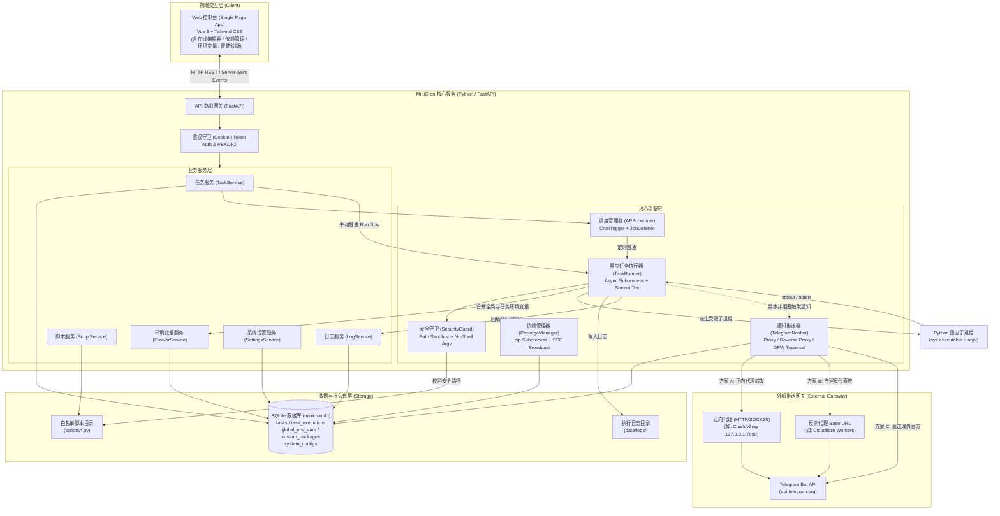
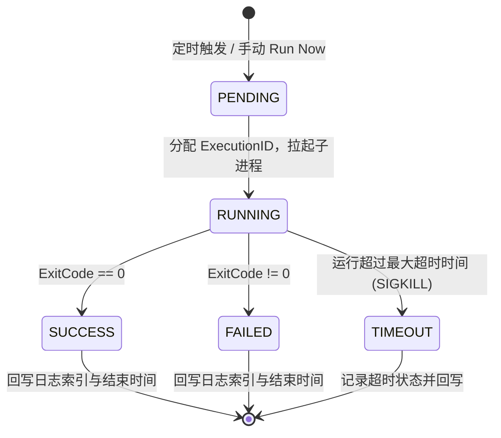
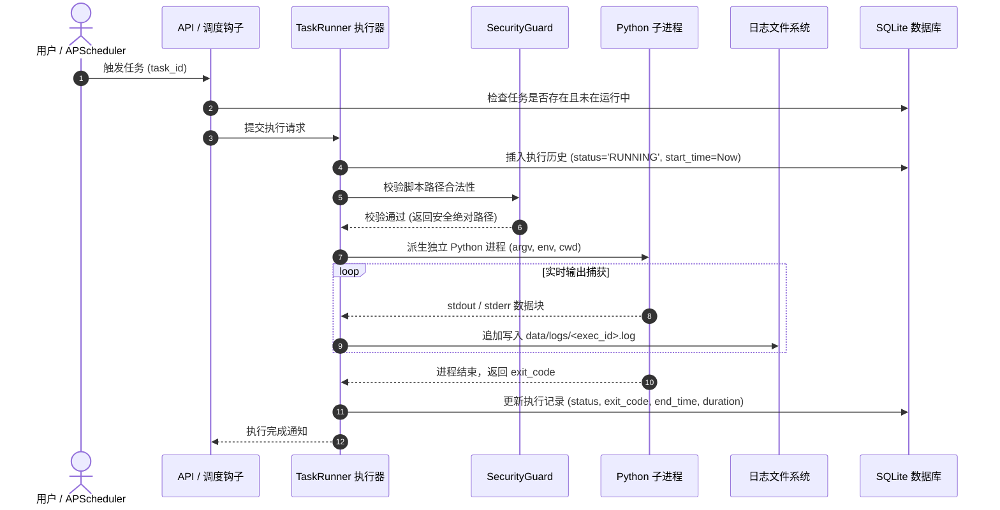
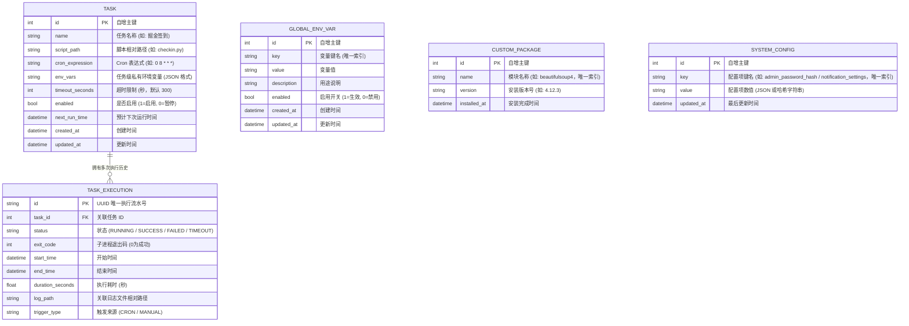

# MiniCron 系统设计与架构方案 (ARCHITECTURE)

---

## 1. 架构目标与设计原则

MiniCron 的设计遵循三大核心原则：
1. **轻量至简 (Minimalist)**：零多余后台进程、零重型中间件依赖（无 Redis、无外部 MQ），单机自包含，系统常驻内存严格控制在 **50MB** 以内。
2. **防注入沙箱 (Security Sandbox)**：将“防命令注入、防路径越权、防未授权访问”作为底层第一设计原则，杜绝由于 Web 界面暴露引发的服务器被提权风险。
3. **高内聚可扩展 (Self-Contained & Extensible)**：前后端一体化单端口交付，调度器与数据持久层紧密联动，支持未来无缝扩展推送渠道（如 Bark / 钉钉 / 企业微信通知）。

---

## 2. 系统整体架构 (System Architecture)



---

## 3. 核心子系统与模块职责

### 3.1 调度管理器 (`app.core.scheduler`)
* **核心组件**：基于 `apscheduler.schedulers.background.BackgroundScheduler`。
* **生命周期集成**：
  * **应用启动**：FastAPI `lifespan` 启动事件中，从 SQLite 遍历所有 `enabled=True` 的任务并注册为 CronJob。
  * **动态热更新**：通过 Web 界面新增、编辑、删除或暂停任务时，调度管理器动态调用 `add_job`、`modify_job`、`remove_job` 或 `pause_job`，**无需重启服务**。
  * **重入保护**：配置 `max_instances=1, coalesce=True`，杜绝同一任务因耗时过长导致定时并发堆叠。

### 3.2 安全任务执行器 (`app.services.runner`)
* **进程隔离**：
  ```python
  # 核心安全执行范例：杜绝 shell=True 与字符串拼接
  process = await asyncio.create_subprocess_exec(
      sys.executable,
      script_absolute_path,
      stdout=asyncio.subprocess.PIPE,
      stderr=asyncio.subprocess.STDOUT,
      env=merged_env,
      cwd=str(SCRIPTS_DIR)
  )
  ```
* **流式日志捕获 (Stream Teeing)**：
  * 子进程的输出通过异步迭代器实时读取。
  * **双向落盘**：一边实时写入对应的文件 `data/logs/<task_id>_<exec_id>.log`，一边广播给当前正在查看实时日志的 Web 客户端。
* **超时终止机制**：
  * 使用 `asyncio.wait_for(..., timeout=task.timeout_seconds)`，超时未退出时向子进程发送 `SIGTERM`，若 3 秒内未退出则强制 `SIGKILL`，防止僵尸进程。

#### 3.3 安全沙箱模型 (`app.core.security`)
在系统安全性上，MiniCron 在架构上设立 4 道硬核防线：

| 防御维度 | 传统定时运维工具常见隐患 | MiniCron 架构级防护 |
| :--- | :--- | :--- |
| **命令执行方式** | 允许输入字符串通过 `sh -c "..."` 执行，极易被拼接注入 (如 `; rm -rf` 或反弹 shell) | 强制使用 `create_subprocess_exec` 列表传参，**彻底禁用系统 Shell 解释器** |
| **文件路径控制** | 未对相对路径严格校验，存在 `../../etc/passwd` 等路径遍历风险 | 强制调用 `path.resolve()`，校验 `child.is_relative_to(SCRIPTS_DIR)`，违者直接阻断 |
| **依赖与动态代码** | 允许从未知 Git 仓库直接拉取执行动态代码，存在供应链投毒 | 只允许执行本地人工放置在 `./scripts` 的脚本，不提供外部任意拉库机制 |
| **接口鉴权体系** | 存在未授权接口或默认空密码，易被公网扫描器撞库爆破 | 启动时强制要求设定 `ADMIN_PASSWORD` 或生成随机强 Token，全量 API 接入鉴权校验 |

### 3.4 模块依赖管理器与容器自愈 (`app.services.package_service`)
* **异步 `pip` 管道执行**：
  * 使用 `asyncio.create_subprocess_exec` 触发 `python -m pip install <package> -i <mirror> --no-cache-dir`。
  * 并发互斥锁设计，同一时间仅允许单个包在后台执行安装，防止底层 pip 锁冲突。
* **Server-Sent Events (SSE) 终端日志广播**：
  * 通过内存多播队列 (`asyncio.Queue`)，将 `pip` 子进程输出的标准输出与标准错误按行实时推送给前端控制台。
* **核心运行库硬拦截保护**：
  * 内置核心依赖集合 `CORE_PACKAGES`（如 `fastapi`, `uvicorn`, `apscheduler`, `aiosqlite`, `pydantic`, `pip` 等）。
  * 拒绝卸载核心模块（抛出 HTTP 400），防止由于 Web 控制台误操作造成 MiniCron 进程崩溃。
* **容器重启自愈自愈恢复 (`restore_custom_packages`)**：
  * 自定义模块安装成功后持久化写入 SQLite `custom_packages` 表；
  * FastAPI 启动时（`lifespan`），系统自动拉取当前 `pip list` 与数据表比对，自动安装缺失依赖，完美解决容器销毁重建后的环境丢失痛点。

### 3.5 全局环境变量多级注入机制 (`app.routers.env_vars` & `app.services.runner`)
* **多级注入模型**：
  ```text
  基础操作系统环境 (os.environ)
            ↓
  全局已启用环境变量 (global_env_vars, enabled=1)
            ↓
  任务独有自定义环境变量 (task.env_vars, JSON Map，同名优先覆盖)
  ```
* **敏感数据脱敏**：
  * 前端以掩码显示（如 `1234••••5678`），支持明文切换与快速复制；
  * 子进程启动日志仅记录注入的 Key 列表，避免日志落盘泄露密钥。

### 3.6 密码持久化与哈希安全模型 (`app.core.security`)
* **PBKDF2-HMAC-SHA256 加盐算法**：
  * 每次生成 16 字节密码学安全随机 Salt，执行 100,000 次加盐迭代哈希；
  * 存储格式：`pbkdf2:sha256:100000$<salt_hex>$<hash_hex>`；
  * 比对时使用 `hmac.compare_digest` 恒定时间比对，杜绝时序攻击（Timing Attack）；
* **多源优先降级策略**：
  * 优先读取 SQLite `system_configs` 中键为 `admin_password_hash` 的记录；
  * 若数据库未配置，则回退兼容环境变量 `ADMIN_PASSWORD` 或默认密码 `admin123`。

### 3.7 通知体系架构与出海代理转发拓扑 (`app.services.notifier`)
为了兼顾系统安全监控与日常自动化任务的良好体验，MiniCron 提供了安全告警与任务通知独立解耦的自适应通知架构：

* **系统安全事件独立告警 (`notify_security_event`)**：
  * **解耦设计**：将登录成功/失败（防暴力破解）、管理员密码修改等高危操作与日常定时任务彻底拆分；
  * **独立推送目标**：共用 Telegram Bot 凭据，但支持为安全通知单独指定 `security_chat_id`（未填写则继承默认 Chat ID），方便管理员将安全告警推送到个人私聊，而将任务通知发到频道或群组；
  * **细分开关**：默认开启「登录失败告警」（含来源 IP 溯源）与「密码修改提醒」，「登录成功」设为可选开关。

* **任务通知策略治理 (`notify_policy`)**：
  * `CUSTOM_ONLY`（默认推荐）：仅当脚本显式调用 `notify.send()` 时推送纯净自定义业务内容；若任务异常崩溃（退出码非 0）由系统兜底告警；普通成功任务保持静默；
  * `ONLY_FAILURE`：仅在任务返回非 0 退出码或超时强杀时推送；
  * `ALWAYS`：无论成功或失败均推送；
  * `OFF`：关闭任务推送。

* **纯净直观业务通知 vs 系统故障兜底（双轨制推送）**：
  * **业务通知（纯净模式）**：脚本中调用 `notify.send(title, content)` 时，MiniCron 通过标准输出结构化协议（`__MINICRON_NOTIFY_START__...__MINICRON_NOTIFY_END__`）精准捕获，直接向 Telegram 推送纯净的 `【标题】+ 正文` 消息，文末附带轻量标注（`🕒 时间戳 · 任务名`），彻底摒弃耗时、退出代码等机器参数噪音；
  * **系统故障兜底**：脚本未主动通知但发生异常退出时，发送精简版故障报警卡片，仅提取末尾关键 Traceback / Error 摘要；
  * **日志自动清洗**：后台控制台查看日志时，自动剥离通知标记块，保证终端日志洁净。

* **国内网络穿透与代理分发方案**：
  * **正向代理 (Forward Proxy)**：
    * 支持 `http://`、`https://`、`socks5://`、`socks5h://` 协议（底层集成 `requests` + `PySocks`）；
    * 典型场景：服务器本地或局域网部署有 Clash/v2ray 代理端口（如 `http://127.0.0.1:7890` 或 `socks5://192.168.1.5:1080`）。
  * **反向代理 Base URL (Reverse Proxy)**：
    * 支持将官方 `https://api.telegram.org` 替换为自定义反代域名（如 `https://tg-proxy.yourdomain.com` 或 Cloudflare Workers 反代）；
    * 优势：国内服务器**无需安装任何代理客户端**即可稳定推送到 Telegram。

* **内置 `notify.py` 通用通知模块 (脚本零侵入)**：
  * 在 `scripts/` 目录内置标准 `notify.py` 模块，提供符合规范的 `send(title, content)` 函数；
  * 脚本运行时工作目录（`cwd`）即为 `scripts/`，因此脚本直接执行 `from notify import send` 即可开箱即用，消除缺文件警告，输出结构化标记由 MiniCron 自动捕获。

* **异步非阻塞解耦**：
  * 任务执行器 `runner.py` 与认证路由 `auth.py` 在子进程执行完毕或安全事件发生后，通过 `asyncio.create_task` 异步触发通知服务，确保推送网络耗时绝对不会阻塞系统主流程。

---

## 4. 任务执行状态机与时序图

### 4.1 状态流转模型



### 4.2 任务触发执行时序图



---

## 5. 数据模型设计 (Database Schema)

MiniCron 采用轻量 SQLite 单文件数据库，开启 **WAL (Write-Ahead Logging)** 模式以支持高并发读写。

### 5.1 数据表关系 (E-R)



---

## 6. 前端控制台架构设计

* **架构选型**：纯静态现代化单页面 (SPA)。
* **技术方案**：
  * 基于现代化 ESM 模块化加载的 Vue 3 + Tailwind CSS。
  * 零构建步骤（无需本地 Node.js、npm build），直接由 FastAPI 的 `StaticFiles` 服务高效托管。
* **界面模块划分**：
  1. **Dashboard 顶部极简全局导航**：
     * 顶部展示系统内存占用；任务总数、已启用数与运行中任务数集中展示在任务汇总区；
     * 核心资产入口：**「📄 脚本管理」**（展示脚本总数徽标）；
     * 一体化控制台：**「⚙️ 设置中心」**（集合通知与代理、环境变量、依赖管理、管理员密码）；
     * 账户安全：**「🚪 退出登录」**。
  2. **任务主看板**：
     * 表格/卡片布局展示所有任务，显示状态、上次耗时、下次触发时间；
     * 操作栏：一键“立即运行”、“查看最新日志”、“编辑”、“启用/禁用开关”。
  3. **任务配置弹窗**：
     * 智能 Cron 表达式输入框 + 实时预演未来 5 次触发时间；
     * 可用脚本下拉单选框，配备「在线编辑此脚本」快捷跳转入口；
     * 任务级私有环境变量动态 Key-Value 编辑器。
  4. **全功能日志抽屉 (Log Viewer)**：
     * 暗色终端风格视图，支持一键清屏、自动滚动追踪最新输出、日志内容复制与下载；
     * **智能缺失依赖诊断横幅 (Smart Diagnostics)**：检测到 `ModuleNotFoundError` 错误时自动弹出黄色警告条，并提供「一键在线安装」快捷直达按钮。
  5. **全功能脚本管理中心 (Script Hub)**：
     * 涵盖已有脚本清单、在线粘贴编写保存、本地 `.py` 文件拖拽上传、在线源码只读查看；
     * **在线代码编辑器**：提供代码高亮、行号与字数统计、Tab 插入 4 空格、`Ctrl+S` / `Cmd+S` 快捷键瞬间保存；
     * **防误删保护机制**：删除脚本前自动检测关联定时任务，被引用时强制拦截并友好提示。
  6. **一体化系统设置中心 (All-in-One Settings Hub)**：
     * 采用侧边栏 Tab 标签切换架构，彻底消除顶栏拥挤，将 4 大系统级模块收敛整合：
       * 🔔 **通知与出海代理**：Telegram Token、Chat ID、三选一网络连接模式（直连/正向代理/反向代理）与实时测试；
       * 🌐 **全局环境变量**：敏感密钥脱敏掩码、明暗文切换、复制、启停与快速增删改；
       * 📦 **Python 依赖管理**：模块清单、在线 pip 安装、清华/阿里/腾讯源切换、SSE 终端日志流；
       * 🔑 **安全与修改密码**：原密码比对、新密码安全校验与持久化落库。
* **前端层级管理规范 (Z-Index Layering)**：
  * **主页面内容区**：`z-0` ~ `z-10`（常规元素与轻量悬浮挂件）；
  * **一级全屏/抽屉浮层**：`z-50`（包括「任务配置弹窗」、「一体化设置中心」、「全功能脚本管理中心」、「日志抽屉」）；
  * **二级子弹窗/对话框**：`z-[60]`（包括「脚本代码在线查看抽屉」、「脚本在线编辑器」、从设置中心打开的「环境变量编辑弹窗」、「依赖安装终端弹窗」等，使用 Tailwind 任意值语法 `z-[60]`，确保完整浮于一级浮层之上且不被遮挡）；
  * **全局确认对话框与 Toast 提示**：`z-[70]`（最高交互提示层；任务、脚本、环境变量删除及依赖卸载共用页面内确认对话框，操作结果通过非阻断 Toast 反馈）。

---

## 7. 部署方案与生产建议

1. **Docker Compose 容器化模式 (生产首选 🌟)**：
   * 基于 `python:3.11-alpine`，完整镜像体积仅 **98.6MB**（网络拉取仅约 35MB），内存占用 < 35MB。
   * 固化时区 `TZ=Asia/Shanghai`，确保定时规则按当地时间精准执行。
   * 双目录挂载：`./data:/app/data` (持久化数据库与日志) 与 `./scripts:/app/scripts` (挂载脚本并支持 Web 界面双向同步热更新)。
   * 启动命令：
     ```bash
     docker compose up -d
     ```
2. **生产环境反向代理建议**：
   * MiniCron 容器绑定映射至宿主机 `127.0.0.1:8000`。
   * 外网使用 Nginx 配置 SSL 证书并反向代理，配合 Fail2ban、Cloudflare 或 Tailscale 内网实现安全访问。
3. **本地 Conda / Python 环境运行 (开发模式)**：
   ```bash
   source ~/.zshrc
   conda activate minicron
   ./start.sh
   ```
