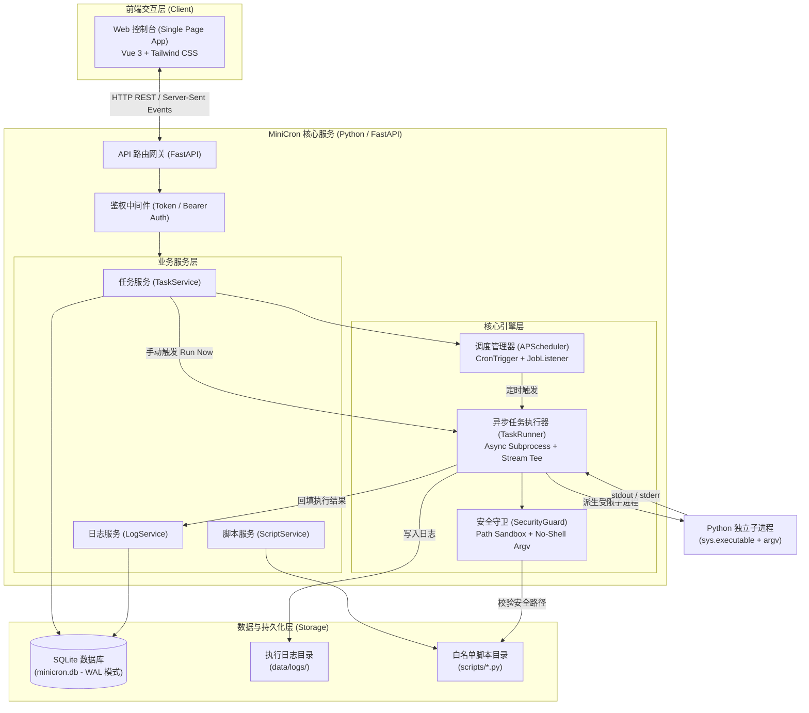
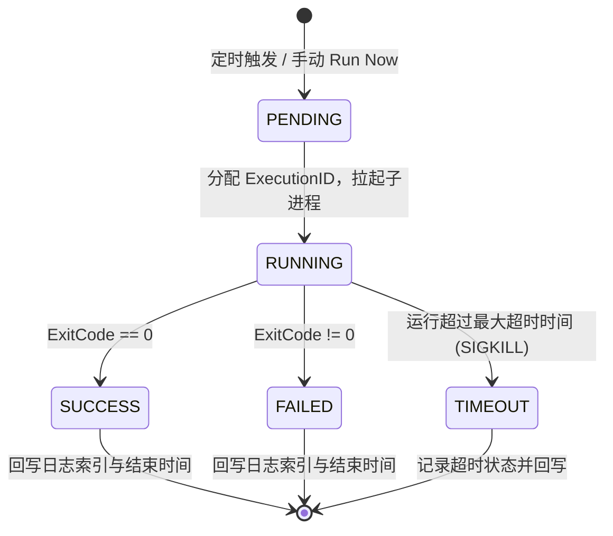
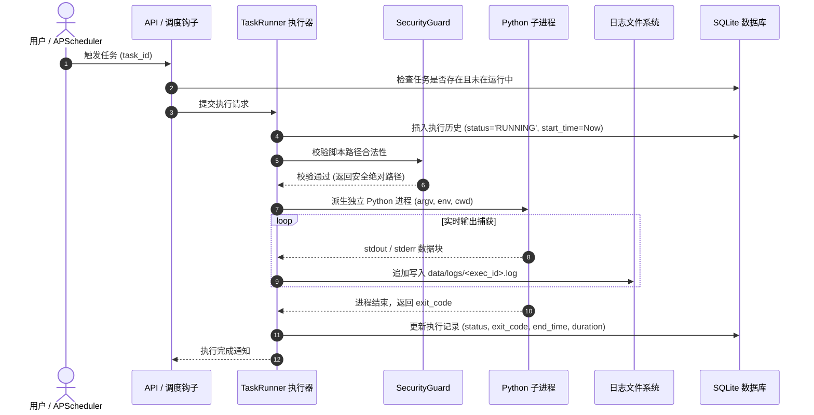
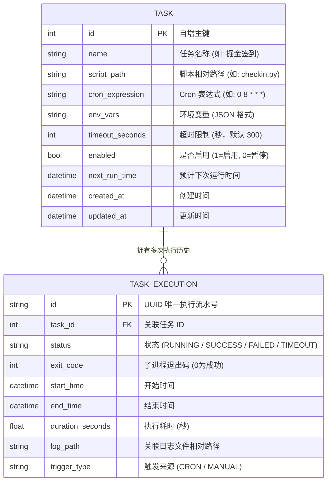

# MiniCron 系统设计与架构方案 (ARCHITECTURE)

---

## 1. 架构目标与设计原则

MiniCron 的设计遵循三大核心原则：
1. **轻量至简 (Minimalist)**：零多余后台进程、零重型中间件依赖（无 Redis、无外部 MQ），单机自包含，系统常驻内存严格控制在 **50MB** 以内。
2. **防注入沙箱 (Security Sandbox)**：将“防命令注入、防路径越权、防未授权访问”作为底层第一设计原则，杜绝由于 Web 界面暴露引发的服务器被提权风险。
3. **高内聚可扩展 (Self-Contained & Extensible)**：前后端一体化单端口交付，调度器与数据持久层紧密联动，支持未来无缝扩展推送渠道（如 Bark / 钉钉 / 企业微信通知）。

---

## 2. 系统整体架构 (System Architecture)



---

## 3. 核心子系统与模块职责

### 3.1 调度管理器 (`app.core.scheduler`)
* **核心组件**：基于 `apscheduler.schedulers.background.BackgroundScheduler`。
* **生命周期集成**：
  * **应用启动**：FastAPI `lifespan` 启动事件中，从 SQLite 遍历所有 `enabled=True` 的任务并注册为 CronJob。
  * **动态热更新**：通过 Web 界面新增、编辑、删除或暂停任务时，调度管理器动态调用 `add_job`、`modify_job`、`remove_job` 或 `pause_job`，**无需重启服务**。
  * **重入保护**：配置 `max_instances=1, coalesce=True`，杜绝同一任务因耗时过长导致定时并发堆叠。

### 3.2 安全任务执行器 (`app.services.runner`)
* **进程隔离**：
  ```python
  # 核心安全执行范例：杜绝 shell=True 与字符串拼接
  process = await asyncio.create_subprocess_exec(
      sys.executable,
      script_absolute_path,
      stdout=asyncio.subprocess.PIPE,
      stderr=asyncio.subprocess.STDOUT,
      env=merged_env,
      cwd=str(SCRIPTS_DIR)
  )
  ```
* **流式日志捕获 (Stream Teeing)**：
  * 子进程的输出通过异步迭代器实时读取。
  * **双向落盘**：一边实时写入对应的文件 `data/logs/<task_id>_<exec_id>.log`，一边广播给当前正在查看实时日志的 Web 客户端。
* **超时终止机制**：
  * 使用 `asyncio.wait_for(..., timeout=task.timeout_seconds)`，超时未退出时向子进程发送 `SIGTERM`，若 3 秒内未退出则强制 `SIGKILL`，防止僵尸进程。

### 3.3 安全沙箱模型 (`app.core.security`)
为彻底吸取青龙面板的安全教训，MiniCron 在架构上设立 4 道硬核防线：

| 防御维度 | 青龙等传统系统常见隐患 | MiniCron 架构级防护 |
| :--- | :--- | :--- |
| **命令执行方式** | 允许输入字符串通过 `sh -c "..."` 执行，极易被拼接注入 (如 `; rm -rf` 或反弹 shell) | 强制使用 `create_subprocess_exec` 列表传参，**彻底禁用系统 Shell 解释器** |
| **文件路径控制** | 未对相对路径严格校验，存在 `../../etc/passwd` 等路径遍历风险 | 强制调用 `path.resolve()`，校验 `child.is_relative_to(SCRIPTS_DIR)`，违者直接阻断 |
| **依赖与动态代码** | 允许从未知 Git 仓库直接拉取执行动态代码，存在供应链投毒 | 只允许执行本地人工放置在 `./scripts` 的脚本，不提供外部任意拉库机制 |
| **接口鉴权体系** | 存在未授权接口或默认空密码，易被公网扫描器撞库爆破 | 启动时强制要求设定 `ADMIN_PASSWORD` 或生成随机强 Token，全量 API 接入鉴权校验 |

---

## 4. 任务执行状态机与时序图

### 4.1 状态流转模型



### 4.2 任务触发执行时序图



---

## 5. 数据模型设计 (Database Schema)

MiniCron 采用轻量 SQLite 单文件数据库，开启 **WAL (Write-Ahead Logging)** 模式以支持高并发读写。

### 5.1 数据表关系 (E-R)



---

## 6. 前端控制台架构设计

* **架构选型**：纯静态现代化单页面 (SPA)。
* **技术方案**：
  * 基于现代化 ESM 模块化加载的 Vue 3 + Tailwind CSS（或单 HTML 嵌入式资源包）。
  * 零构建步骤（无需本地 Node.js、npm build），直接由 FastAPI 的 `StaticFiles` 服务托管。
* **界面模块划分**：
  1. **Dashboard 顶部栏**：服务器当前时间、运行中任务数、系统内存消耗监控、退出登录。
  2. **任务主看板**：
     * 卡片/表格布局展示所有任务。
     * 支持一键“立即运行”、“查看最新日志”、“编辑”、“启用/禁用开关”。
  3. **任务配置弹窗**：
     * 智能 Cron 表达式输入框 + 预演未来 5 次时间预测。
     * 可用脚本下拉单选框（自动过滤非法文件）。
     * 环境变量动态 Key-Value 编辑器。
  4. **全功能日志抽屉 (Log Viewer)**：
     * 黑色终端风格视图，支持一键清屏、自动滚动追踪最新输出、日志内容复制与下载。

---

## 7. 部署方案与生产建议

1. **直接运行 (极简模式)**：
   ```bash
   pip install -r requirements.txt
   export ADMIN_PASSWORD="your_secure_password"
   python -m app.main
   ```
2. **生产环境反代建议**：
   * MiniCron 绑定监听 `127.0.0.1:8000`。
   * 前端使用 Nginx 配置 SSL 证书并反向代理，配合 Fail2ban 或 Cloudflare 实现公网防护。
3. **Docker 轻量容器模式**：
   * 基于 `python:3.11-slim`，镜像体积精简至 < 150MB。
   * 挂载 `./data` (数据库与日志) 和 `./scripts` (用户脚本) 两个目录，持久化与升级无缝切换。
